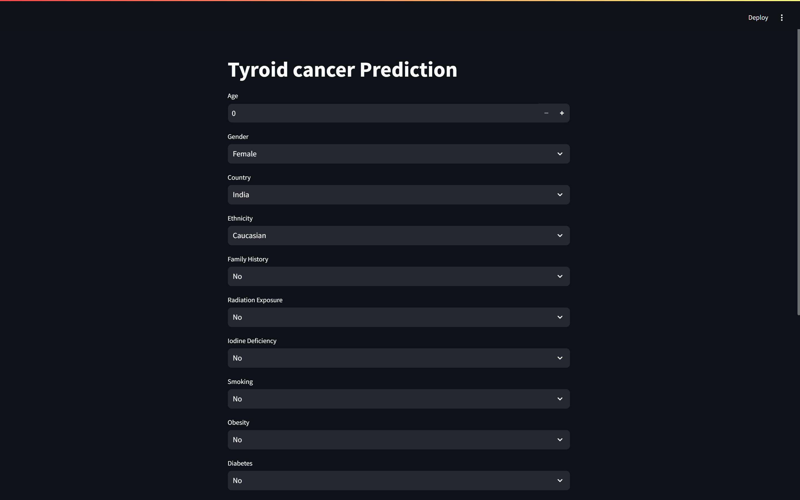
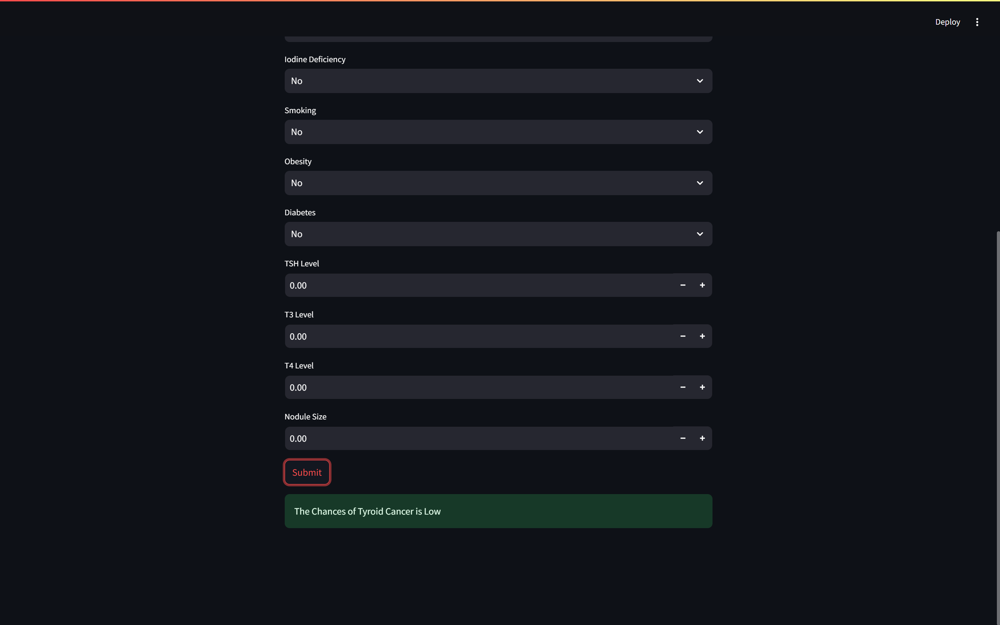

# 🧪 Thyroid Cancer Prediction – Machine Learning Project

A predictive ML system to assess the likelihood of thyroid cancer using patient medical data. Designed to support early diagnosis with a clean, user-friendly interface.

---

## 💻 What It Does

- Predicts thyroid cancer risk based on user input  
- Built with an **XGBoost model (80.4% accuracy, 91% precision on positives)**  
- Interactive web interface using **Streamlit**

---

## 🛠️ Tech Stack

- **Python**  
- **Pandas**, **NumPy**  
- **Scikit-learn**, **XGBoost**  
- **Streamlit**  
- **Matplotlib**, **Seaborn** (for EDA)

---

## 📊 Workflow

1. **Data Cleaning** – removed nulls, handled outliers, encoded features  
2. **EDA** – analyzed distributions, feature relationships  
3. **Modeling** – compared classifiers, selected XGBoost  
4. **Deployment** – built and deployed Streamlit app

---

## 🔍 Key Features

- Real-time risk prediction with clear output  
- User-friendly symptom input form  
- Medical-friendly, interpretable results

---

## 📁 Project Files

```

Thyroid-Cancer-Prediction/
├── thyroid\_predictor.py         # Streamlit app
├── model.pkl                    # Trained XGBoost model
├── dataset.csv                  # Cleaned dataset
├── notebook.ipynb               # EDA + model building
├── Thyroid\_Cancer\_Prediction\_Report.pdf  # Project report
├── screenshots/
│   ├── screenshot1.png          # Form input UI
│   └── screenshot2.png          # Prediction result UI
└── README.md

```

---

## 🖼️ App Preview

### 🔹 Input Form  


### 🔹 Prediction Result  


---

## 📄 Project Report

For a detailed explanation of data processing, modeling, and deployment:  
👉 [Read Full Report (PDF)](./Thyroid_Cancer_Prediction_Report.pdf)

---

## 📅 Date  
March 2025

## 👤 Author  
**Mohammed Shefin**  
[GitHub – shefin01](https://github.com/shefin01)
